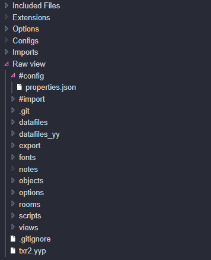

# raw-directories

This extension adds a "raw view" to resource tree, allowing you to navigate project directories inside GMEdit.
Handy for editing non-resource files inside project directories!

You can configure raw directory path(s) in Project Properties.

[Install instructions](https://github.com/GameMakerDiscord/GMEdit/wiki/Using-plugins#installing-plugins)